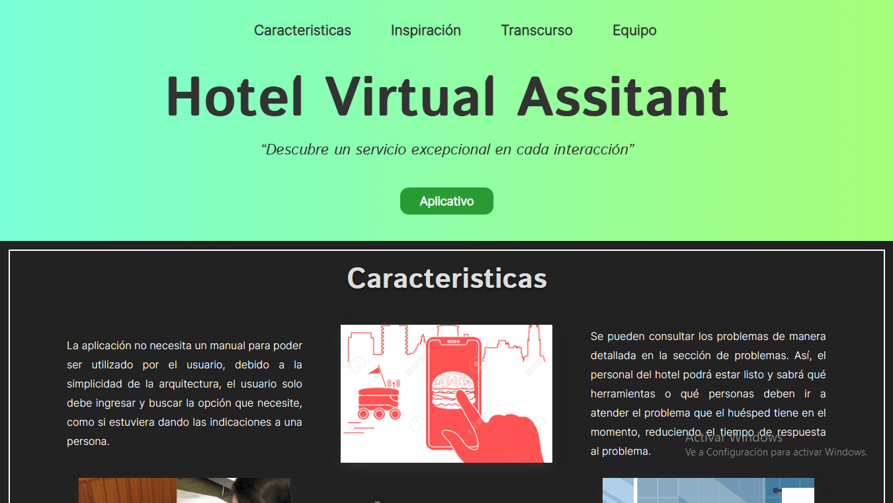

<div align='center'>
 <h1><em>💻Landing Page HVA 🚀</em></h1>
  
 <p>  </p>
 <p>  </p>
<p align='justify'>
 In this project we will see the work done during 1 month with the holberton team on a virtual assistant for hotels.
</p>

</div>

## Built With

For these project, the following tools, frameworks/libraries and development environments (IDEs) were used:

- 
- 
- 
- 
- 
- 
- 
- 

## Responsive Design (mobile & tablet)

These are the project's designs optimized for both mobile and tablet viewing, complying with different screen resolutions and maintaining a consistent user experience across different screen sizes.

<div align="center">
  
   
</div>

## Getting Started
### Prerequisites

> You must meet certain requirements, you must first have a `node.js`.
>
>> Install `npm`.
```sh
 npm install npm@latest -g
```

>> Install `vite`.
```sh
 npm install -g vite
```

### Installation
[!USE]

> To deploy your application on-premises, you must follow the steps below.
>
>> Clone the repo
```sh
 git clone https://github.com/juanRCoder/Project-Landing_HVA.git
```

>> Install NPM packages
```sh
 npm install
```

>> View the app
```sh
// mode development
 npm run dev
// final mode
 npm run start
```

## Resources Provided

#### Fonts:

Link: [https://fonts.googleapis.com/css2?family=Inter:wght@100;200;300&family=Istok+Web:ital,wght@0,400;0,700;1,400&display=swap](https://fonts.googleapis.com/css2?family=Inter:wght@100;200;300&family=Istok+Web:ital,wght@0,400;0,700;1,400&display=swap)

1. Inter-wght@100;200;300
2. Istok Web-wght@0,400;0,700

## Contact

> Juan Ramirez
> Linkedin : [@juan Ramirez](https://www.linkedin.com/in/juan-ramirez-490b84271/)
> Instagram : [@juanrcoder](https://www.instagram.com/juanrcoder/)

> Jhony Arana
> Linkedin: [@Jhony Arana](https://www.linkedin.com/in/jhony-arana-carranza-a103b350/)
> Github: [Jharanza](https://github.com/Jharanza)

> Oscar Morales
> Linkedin: [@Oskar Morales](https://www.linkedin.com/in/oskarmorales/)
> Github: [0skarmp](https://github.com/0skarmp)

## Link
Project Link: [https://juanrcoder.github.io/Project-Landing_HVA/](https://juanrcoder.github.io/Project-Landing_HVA/)

<!--
[!NOTE]: Una nota general que proporciona información o contexto.
[!IMPORTANT]: Una nota importante que debe leerse cuidadosamente.
[!USE]: Una nota que proporciona instrucciones sobre cómo usar algo.
[!BUG]: Una nota que informa sobre un error o problema.
[!TODO]: Una nota que indica una tarea pendiente.
También hay otros tipos de notas menos comunes, como:

[!HACK]: Una nota que proporciona un truco o solución alternativa.
[!WARNING]: Una nota que advierte sobre un peligro o riesgo.
[!DEPRECATED]: Una nota que informa sobre una característica o funcionalidad que ya no se usa.
[!SECURITY]: Una nota que informa sobre una vulnerabilidad de seguridad. -->
